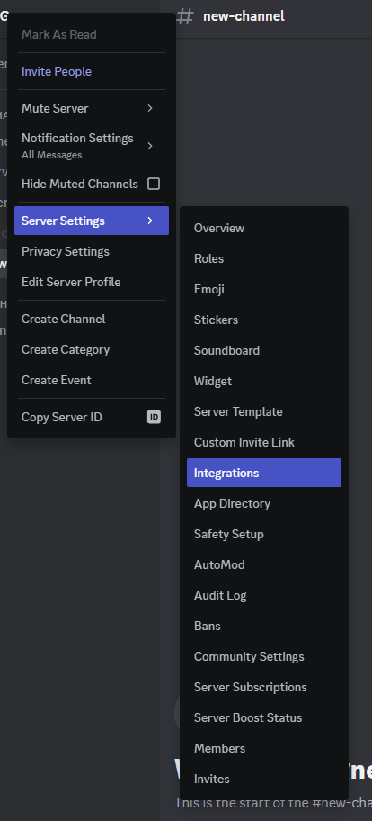
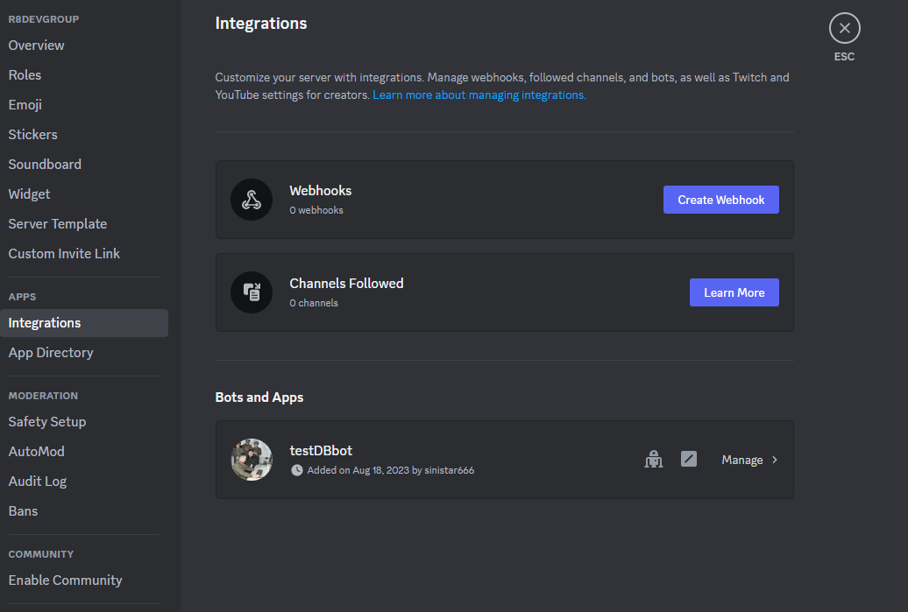
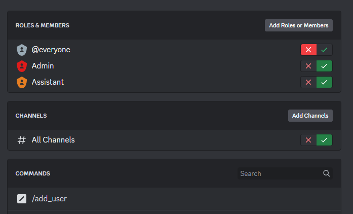
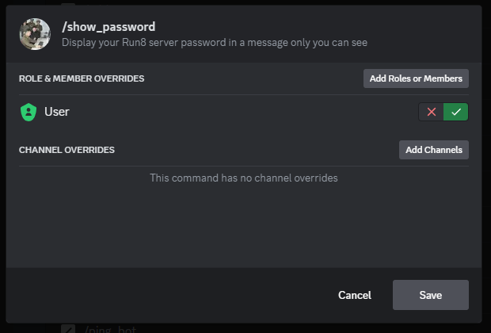
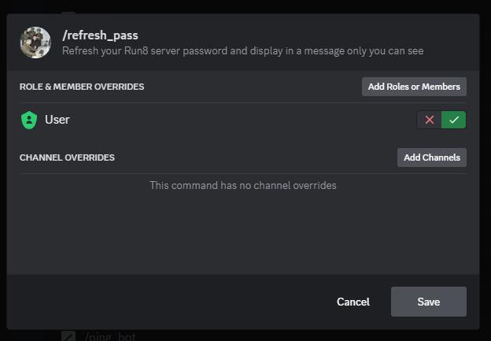
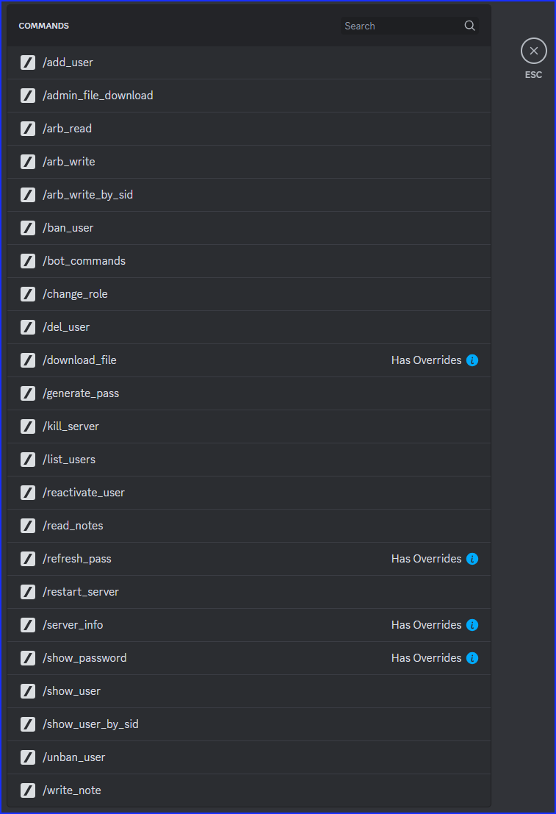

## R8DIUM configuration and operation


## Configuring the config file (r8dium.cfg)

The configuration file contains import fields which you will need to fill in with a text editor. Do not rename this file, and do not change any of the field names (words within [brackets] or to the left of an equals (=)  sign). Here is the example config that comes with the software. Rename this file “r8dium.cfg” and edit as needed:


```
[local]
db_name = r8diumDb
log_file = r8dium
# Please consider leaving the following value set to True as it will help us determine future developments
# Currently the statistics sent are a unique hashed server ID and the number of users your database contains
send_stats = False

[discord]
# bot_token is PRIVATE and unique to the particular bot instance
bot_token = [insert BOT token]
# ch_admin is the name of the channel on the Discord server which will be used to notify admins of important info
ch_admin = server_admin
# ch_log is the name of the channel on the Discord server which will house the log of all commands sent to
# the bot. Enter 'None' to disable this feature.
ch_log = bot_log
# Number of seconds between scanning database for unbanning users
ban_scan_time = 60


[run8]
# security_file is the name of the run8 security configuration xml file
security_file = HostSecurity.xml
---
```


### Explanation of configuration fields:

**<code>db_name</code></strong>is the name of the file (with .csv added) which will contain the database info for your users. Suggest to leave at the default.

**<code>log_file</code></strong>is the name of the file (with .log added) which will track actions the bot performs. Suggest to leave at the default.

**<code>send_stats</code></strong>should be either <strong>True </strong>or <strong>False</strong>. If set to True, the bot will send a small amount of statistics to the developer (a unique anonymous identifier for your server, and the number of users in the database). It is much appreciated if you leave this set to <strong>True</strong>

**<code>bot_token</code></strong>is where you will paste your unique Discord bot token acquired from the Discord developer portal.

**<code>ch_admin</code></strong>is the name of the channel which the bot will use to post important messages for admins to see

**<code>ch_log</code></strong>is the name of the channel which the bot will use to log all command requests sent to it.

**<code>ban_scan_time</code></strong>is the time (in seconds) between each check for an unbanned user (due to timeout). Suggest leaving at default.

**<code>security_file</code></strong>is the path and filename for the server HostSecurity.xml file. \
<em>NOTE</em>: Run8 requires this file to be in the /Content directory, not in the same directory as ServerConfig.xml


---


## Create a new database (if needed)

If you are starting from scratch, rename the file “r8diumDb-blank.csv” to “r8diumDb.csv” (assuming you did not change the db_name field in the configuration file. If you did, rename the file to match.)

If you already have an existing database from a previous installation, just make sure it is named properly and R8DIUM should be able to access it as usual.


---


## Configuring the bot on your server:

When you first add the bot to your server, you need to set some boundaries on which commands can be executed by your members. This is done by selecting Server settings -> Integrations:


---

Then choose “Manage” for your bot:




First, disable all the bot commands for Everyone, and then add the back for your two upper levels roles (the same as specified in the cfg file as lvl0 and lvl1 - here in this example, those roles are named Admin and Assistant. Also make sure your bot can be accessed in all channels (unless you want to restrict) as shown:



Then configure the two commands we want our users to have access to which are /refresh_password and /show_password (optionally /bot_ping too).
Click on them each in turn and add exceptions as shown:


-


-

Recall that in this example, the “User” role is the same as usr_lvl2 in the configuration file and is the role that you assign to those Discord server members who have been granted access to the server. They are the only ones who need to have access to the password commands.


After these are added, they will show in  the command list like this:




(Note in this case, the /bot_ping command was also given user access)

Make sure to save and then test.

**NOTE**: The Discord server owner will always have access to commands, no matter what role(s) they have - so you will need to have the help of a user or another member of the server to test the role/bot permissions.


---


## 


## Running the bot

Depending on your local installation of Python, there may be differing ways for you to start R8DIUM. Regardless, you will need to start from a command window, or a batch file. That command will look something like:

C:<directory_where_R8DIUM_is_installed> python r8dium.py

The bot will write some status messages to the console. The important ones to look for are:

“Registered 16 command(s)”

and

“Starting banned user periodic checks”

If you made it this far, your system *should* be running!


## 


---


## Using the bot

_NOTE_: <span style="text-decoration:underline;">All</span> responses to commands are sent back as private, so no others can see.

When first starting, you will have a bit of work ahead of you in adding all your current users. You (and your yardmasters) will be using the /add_user command for each of your server members (including themselves). The bot will prevent duplicates from being entered. 

To add a user just type:


```
/add_user @username 
```


Just as if you were pinging that user in a normal discord message

You will see a PM returned by the bot giving you a bit of info which should indicate the user has been added, and a password generated for them.

Each user will be assigned a unique Server ID (SID) when they are created. This ID will be used to interact with some of the other fields within a user record.

At any time you can ask the bot for a list of users:


```
/list_users
```


If you somehow add a user you don’t want any longer, you can:


```
/del_user <sid>
```


During server operation, you are able to ban a user with the command:


```
/ban_user <sid> <duration> <reason>
```


Where _duration _is in days, and the _reason _is just a quick explanation as to the reason for the ban

If it is desired to unban a user before their ban duration has elapsed, you can simply use:


```
/unban_user <sid>
```


You can show details on a specific user with:


```
/show_user <sid>
```


You can add and read notes on a user with:


```
/write_note <sid> <note>
```


and


```
/read_notes <sid>
```


There are more commands. All bot commands can be shown with:


```
/bot_commands
