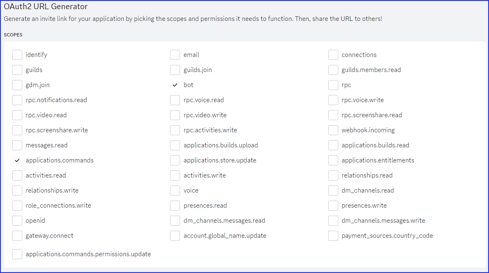
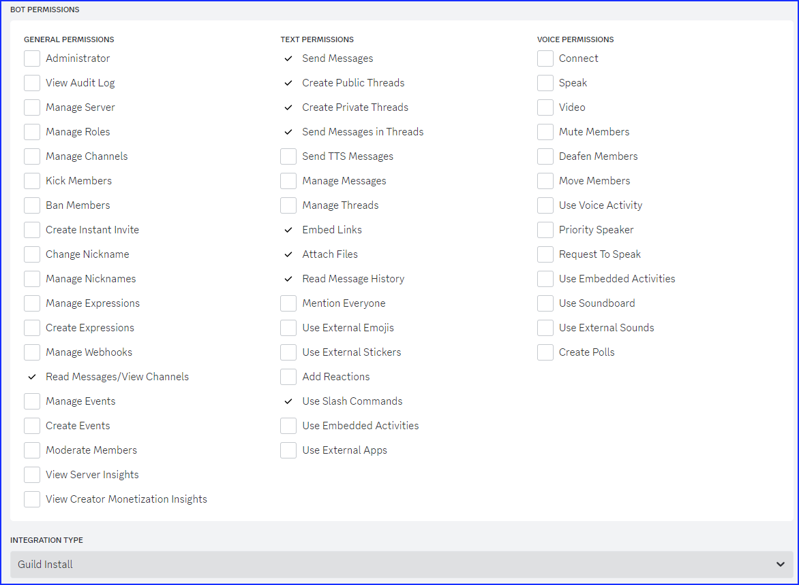

## Discord bot OAuth2 URL invite creation

From the bot management page, select the following fields to generate the OAuth2 invite URL:





## R8DIUM configuration and operation


## Configuring the config file (r8dium.cfg)

The configuration file contains import fields which you will need to fill in with a text editor. 
Do not rename this file, and do not change any of the field names (words within [brackets] or to the left of an equals (=)  sign). 
See the file "[r8dium_example.cfg](https://github.com/sjstein/R8DIUM/blob/master/r8dium_example.cfg)" for explanation of the fields.

## If you are running R8DIUM for the first time, it will create a blank user database for you. 


## Configuring the bot on your server:

When you first add the bot to your server, you need to set some boundaries on which commands can be executed by your members. 
This is done by selecting Server settings -> Integrations:


---

Then choose “Manage” for your bot:


First, disable all the bot commands for Everyone, and then add the back any roles you want to have access to ALL bot commands. 
These should be administrative types. In this example they are named "Admin", and "Assistant"


Then configure the commands we want our users to have access to which are /refresh_password, /show_password, /server_info, and (optionally) /download_file
Click on them each in turn and add exceptions as shown:


-


-


After these are added, they will show in  the command list like this:


Make sure to save and then test.

**NOTE**: The Discord server owner will always have access to commands, no matter what role(s) they have - so you will need to have the help of a user or another member of the server to test the role/bot permissions.


---


## 


## Running the bot

Depending on your local installation of Python, there may be differing ways for you to start R8DIUM. Regardless, you will need to start from a command window, or a batch file. That command will look something like:

C:<directory_where_R8DIUM_is_installed> python r8dium.py

The bot will write some status messages to the console. The important ones to look for are:

“Registered 16 command(s)”

and

“Starting banned user periodic checks”

If you made it this far, your system *should* be running!


## 


---


## Using the bot

_NOTE_: <span style="text-decoration:underline;">All</span> responses to commands are sent back as private, so no others can see.

Assuming you have a Discord role for those users who have access to your Run8 server, populated the user database should be simple. 
Just make a general announcement to your users that you are switching to private passwords, and tell them to use the `/show_password` command to see theirs.
When they use this command, if they are not currently captured in the user database, they will first be added and then a password assigned and shown to them.

Of course, as an admin you can also add users by typing:

```
/add_user @username 
```


Just as if you were pinging that user in a normal discord message

You will see a PM returned by the bot giving you a bit of info which should indicate the user has been added, and a password generated for them.

Each user will be assigned a unique Server ID (SID) when they are created. This ID will be used to interact with some of the other fields within a user record.

At any time you can ask the bot for a list of users:


```
/list_users
```


If you somehow add a user you don’t want any longer, you can:


```
/del_user @username
```


During server operation, you are able to ban a user with the command:


```
/ban_user @username <duration> <reason>
```


Where _duration _is in days, and the _reason _is just a quick explanation as to the reason for the ban

If it is desired to unban a user before their ban duration has elapsed, you can simply use:


```
/unban_user @username
```


You can show details on a specific user with:


```
/show_user @username
```


You can add and read notes on a user with:


```
/write_note @username <note>
```


and


```
/read_notes @username
```


There are more commands. All bot commands can be shown with:


```
/bot_commands
